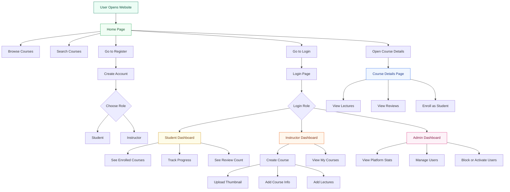
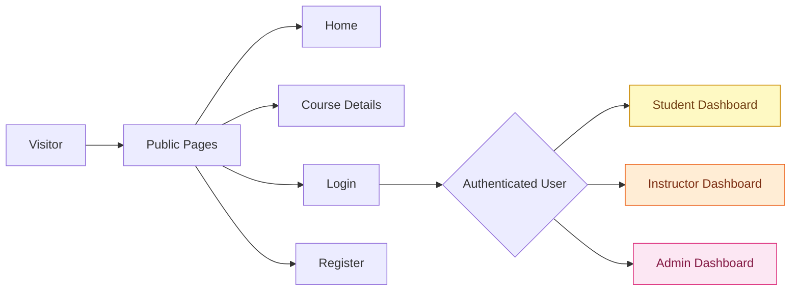

# SkillForge Frontend Flowchart

This version is made for presentations, demos, and reports.

It shows how a user moves through the frontend and how the main pages connect.

## Simple User Flow



## Frontend Structure Summary

```text
Root
└── Router
    └── Auth Provider
        └── App
            └── Layout
                ├── Header
                ├── Main Page Content
                └── Footer
```

## Main Pages

### Home Page
- Shows the website introduction.
- Lets users search and browse courses.
- Opens course details.

### Course Details Page
- Shows course title, description, price, and thumbnail.
- Shows lecture list and student reviews.
- Lets a student enroll.

### Login and Register
- Register allows `Student` and `Instructor` only.
- Login supports `Student`, `Instructor`, and existing `Admin` users.

### Student Dashboard
- Shows enrolled courses.
- Shows progress and completion information.

### Instructor Dashboard
- Lets instructors create courses.
- Lets instructors upload thumbnails.
- Lets instructors add lectures before creating the course.
- Shows all courses created by the instructor.

### Admin Dashboard
- Shows total users, courses, and enrollments.
- Lets admin manage user status.

## Role-Based Access



## Short Explanation for Report

SkillForge uses a shared layout with a header, main content area, and footer. Public users can browse courses, search, register, and log in. After login, each user is redirected to a dashboard based on role. Students manage learning progress, instructors create courses and lectures, and admins manage platform users and overall activity.

## How to View

1. Open this file in VS Code.
2. Press `Ctrl+Shift+V`.
3. Use the Mermaid diagrams directly in your report screenshots or presentation.