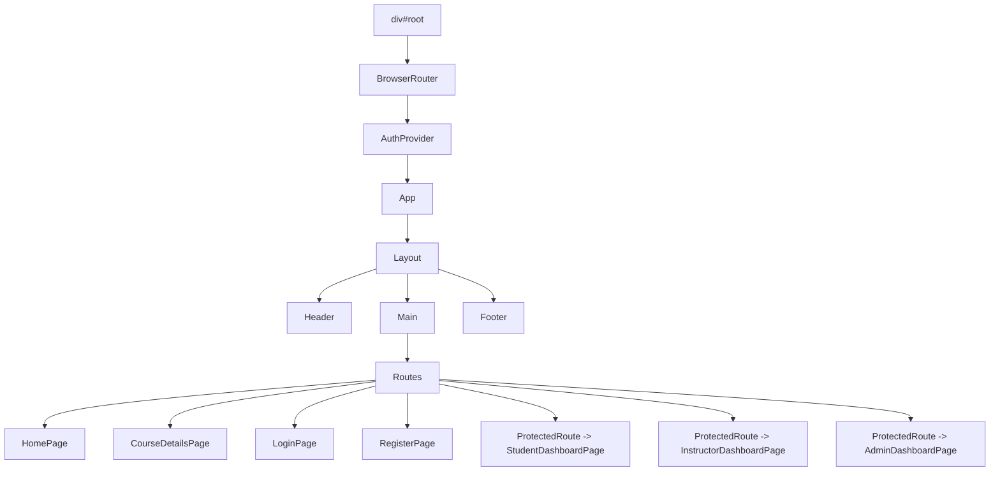

# SkillForge Frontend DOM Guide

This file explains the frontend structure in a simple way.

## 1. Big Picture

The app starts at `div#root`, then React renders the router, auth provider, and the main app.

```text
div#root
└── BrowserRouter
  └── AuthProvider
    └── App
      └── Layout
        ├── Header
        ├── Main Content (changes by route)
        └── Footer
```

## 2. What Each Layer Does

- `BrowserRouter`: handles page navigation without full page reloads.
- `AuthProvider`: stores login state, current user, token, and auth actions.
- `App`: defines all routes.
- `Layout`: wraps every page with the same header and footer.

## 3. Main Layout Structure

Every page is shown inside the same layout:

```text
Layout
├── Header
│   ├── Logo / SkillForge brand
│   ├── Navigation
│   │   ├── Courses
│   │   └── Dashboard (only when logged in)
│   └── Auth actions
│       ├── Login / Join (logged out)
│       └── User badge / Logout (logged in)
├── Main
│   └── Current page from router
└── Footer
  ├── Platform summary
  └── Copyright text
```

## 4. Route Map

```text
/
├── HomePage

/courses/:courseId
├── CourseDetailsPage

/login
├── LoginPage

/register
├── RegisterPage

/student/dashboard
├── ProtectedRoute
└── StudentDashboardPage

/instructor/dashboard
├── ProtectedRoute
└── InstructorDashboardPage

/admin/dashboard
├── ProtectedRoute
└── AdminDashboardPage
```

## 5. Protected Routes

Some pages are only visible to logged-in users with the correct role.

```text
ProtectedRoute
├── If user is not logged in
│   └── Redirect to /login
├── If user has wrong role
│   └── Redirect to /
└── If user is allowed
  └── Render dashboard page
```

## 6. Page-by-Page DOM Breakdown

### Home Page

```text
HomePage
├── Hero section
│   ├── Title
│   ├── Description
│   ├── Start learning button
│   └── Search input
├── About website panel
│   └── Role summaries
├── Section heading
└── Course grid
  └── Course card
    ├── Thumbnail
    ├── Category / Level badges
    ├── Title
    ├── Short description
    ├── Instructor + stats
    └── View Course button
```

### Course Details Page

```text
CourseDetailsPage
├── Top hero section
│   ├── Course category / level / language
│   ├── Title
│   ├── Description
│   ├── Instructor and rating info
│   └── Side panel
│       ├── Thumbnail
│       ├── Price
│       ├── Stats cards
│       └── Enroll button or notice
├── Course Content section
│   └── Lecture list
│       └── Lecture card
│           ├── Order number
│           ├── Lecture title
│           ├── Preview badge
│           ├── Description
│           └── Duration
└── Student Reviews section
  └── Review card
    ├── Student name
    ├── Rating
    └── Comment
```

### Login Page

```text
LoginPage
├── Welcome side panel
│   └── Short role descriptions
└── Login form
  ├── Email
  ├── Password
  ├── Role
  ├── Error message
  └── Login button
```

### Register Page

```text
RegisterPage
└── Register form
  ├── First name
  ├── Last name
  ├── Email
  ├── Password
  ├── Role
  │   ├── Student
  │   └── Instructor
  ├── Status message
  └── Create account button
```

### Student Dashboard

```text
StudentDashboardPage
├── Page title
├── Stats cards
│   ├── Enrolled
│   ├── Completed
│   └── Reviews
└── My Courses grid
  └── Enrolled course card
    ├── Course title
    ├── Progress
    └── Payment status
```

### Instructor Dashboard

```text
InstructorDashboardPage
├── Page title
├── Stats cards
│   ├── Total courses
│   ├── Published
│   └── Total students
├── Create Course form
│   ├── Basic course fields
│   ├── Thumbnail upload
│   ├── Category / level / price
│   ├── Lecture builder
│   │   ├── Lecture title
│   │   ├── Video URL
│   │   ├── Description
│   │   ├── Duration
│   │   ├── Preview checkbox
│   │   └── Added lectures list
│   └── Create Course button
└── My Courses grid
  └── Course card
    ├── Thumbnail
    ├── Category / Level / Status badges
    ├── Title + subtitle
    ├── Description
    ├── Stats row
    └── Language + lecture count
```

### Admin Dashboard

```text
AdminDashboardPage
├── Page title
├── Stats cards
│   ├── Total users
│   ├── Total courses
│   └── Total enrollments
└── Users table
  ├── Name
  ├── Email
  ├── Role
  ├── Status
  └── Action button
```

## 7. Mermaid Diagram

If you want the visual version, use this smaller diagram:



## 8. Source Files Used

- `src/main.jsx`
- `src/App.jsx`
- `src/components/Layout.jsx`
- `src/components/ProtectedRoute.jsx`
- `src/pages/HomePage.jsx`
- `src/pages/CourseDetailsPage.jsx`
- `src/pages/LoginPage.jsx`
- `src/pages/RegisterPage.jsx`
- `src/pages/StudentDashboardPage.jsx`
- `src/pages/InstructorDashboardPage.jsx`
- `src/pages/AdminDashboardPage.jsx`

## 9. How to View It Nicely in VS Code

1. Open this file.
2. Press `Ctrl+Shift+V`.
3. Scroll to the Mermaid section to see the rendered diagram.
